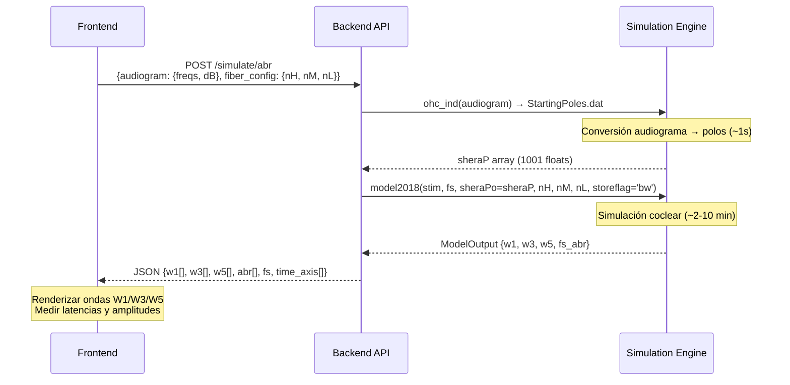

# Puntos de Integración: Modelo Verhulst - Screening BERA/ABR

## 1. Inputs Localizados: Perfiles Patológicos y Polos de Shera

### 1.1. Inyección Directa de Polos de Shera (Pérdida OHC)

* **Módulo/Archivo:** [model2018.py](file:///c:/Users/valen/Documents/1%20-%20Valen/Soporte/regelabo-main/backend/backend/services/simulation-service/src/Verhulst/src/model2018.py)
* **Función responsable:** [model2018()](file:///c:/Users/valen/Documents/1%20-%20Valen/Soporte/regelabo-main/backend/backend/services/simulation-service/src/Verhulst/src/model2018.py#L65-L145)
* **Parámetro a inyectar:** `sheraPo`
* **Tipo de dato esperado:** `float` (valor único para todas las secciones) **o** `np.ndarray` de shape `(1001,)` (un valor por sección coclear + oído medio)
* **Efecto biológico:** Controla la ganancia del amplificador coclear (OHC) en cada sección. Un polo mayor → menos amplificación → más pérdida auditiva.
* **Cómo se propaga al modelo coclear:** En [cochlear_model2018.py](file:///c:/Users/valen/Documents/1%20-%20Valen/Soporte/regelabo-main/backend/backend/services/simulation-service/src/Verhulst/src/core/cochlear_model2018.py#L261-L271), `init_model()` asigna `self.SheraPo = np.zeros(sections+1) + sheraPo`, donde `sheraPo` puede ser escalar o vector.

### 1.2. Perfiles Pre-computados (Flat / Slope / Combinados)

* **Directorio de datos:** [data/Poles/](file:///c:/Users/valen/Documents/1%20-%20Valen/Soporte/regelabo-main/backend/backend/services/simulation-service/src/Verhulst/data/Poles)
* **Formato de archivo:** `StartingPoles.dat` — texto plano con 1001 valores float (formato `%.6E`), uno por línea
* **Perfiles Flat (pérdida plana uniforme):**

| Carpeta | Significado |
|---|---|
| `Flat00` | Audición normal (sin pérdida OHC) |
| `Flat05` a `Flat35` | Pérdida plana de 5 a 35 dB HL |

* **Perfiles Slope (pérdida en caída hacia agudos):**

| Carpeta | Significado |
|---|---|
| `Slope00` a `Slope35` | Pendiente progresiva de 0 a 35 dB |
| `Slope05_5` a `Slope35_5` | Variantes con inclinación intermedia |

* **Perfiles combinados (Flat + Slope):**

| Carpeta | Significado |
|---|---|
| `Flat00_Slope05` a `Flat00_Slope35` | Base plana 0 dB + pendiente variable |
| `Flat30_Slope35` | Base plana 30 dB + pendiente 35 dB |

* **Carga en código:**
```python
# Ejemplo: cargar perfil Flat20 (20 dB pérdida plana)
sheraP = np.loadtxt('.../data/Poles/Flat20/StartingPoles.dat')
```

### 1.3. Conversión de Audiograma Clínico a Polos (OHC_ind)

* **Módulo/Archivo:** [OHC_ind.py](file:///c:/Users/valen/Documents/1%20-%20Valen/Soporte/regelabo-main/backend/backend/services/simulation-service/src/Verhulst/src/utils/OHC_ind.py)
* **Función responsable:** [ohc_ind()](file:///c:/Users/valen/Documents/1%20-%20Valen/Soporte/regelabo-main/backend/backend/services/simulation-service/src/Verhulst/src/utils/OHC_ind.py#L111-L371)
* **Parámetros de entrada:**

| Parámetro | Tipo | Descripción |
|---|---|---|
| `name` | `str` | Nombre del perfil (crea carpeta `Poles/<name>/`) |
| `hl_freqs_hz` | `list[float]` | Frecuencias del audiograma en Hz (orden libre) |
| `hl_db` | `list[float]` | Pérdida auditiva en dB HL por cada frecuencia |
| `base_dir` | `str` | Directorio base donde están `mat files/` y `Poles/` |
| `show_figs` | `bool` | Mostrar gráficos de diagnóstico |

* **Salida generada:** `Poles/<name>/StartingPoles.dat` — array `(1001,)` listo para inyectar como `sheraPo`
* **Retorno:** `dict` con claves `cf`, `HL_sections`, `StartingPolesNH`, `StartingPolesHI`, `ModelQ`, `ModelQHI`, `output_dir`

> [!IMPORTANT]
> **Este es el punto de entrada principal para el frontend BERA.** Permite recibir un audiograma arbitrario del fonoaudiólogo y convertirlo automáticamente en polos de Shera, eliminando la necesidad de seleccionar manualmente un perfil pre-computado.

### 1.4. Sinaptopatía Coclear (Pérdida IHC / Sordera Oculta)

* **Módulo/Archivo:** [model2018.py](file:///c:/Users/valen/Documents/1%20-%20Valen/Soporte/regelabo-main/backend/backend/services/simulation-service/src/Verhulst/src/model2018.py#L75-L77)
* **Parámetros a inyectar:** `nH`, `nM`, `nL`
* **Tipos de dato:** `int` (escalar para todas las secciones) **o** `np.ndarray` (distribución tonotópica)

| Parámetro | Default | Tipo de fibra AN | Significado clínico |
|---|---|---|---|
| `nH` | 13 | HSR (High Spontaneous Rate) | Bajo umbral, saturan rápido |
| `nM` | 3 | MSR (Medium Spontaneous Rate) | Umbral intermedio |
| `nL` | 3 | LSR (Low Spontaneous Rate) | Alto umbral, cruciales en ruido |

* **Efecto biológico:** Reducir `nL` y/o `nM` simula **sinaptopatía coclear** (sordera oculta) — pérdida de sinapsis ribbon sin cambio en el audiograma tonal. Esto reduce la amplitud del ABR (especialmente W1) sin modificar los umbrales.

---

## 2. Outputs Localizados: Simulación de Ondas ABR (W1, W3, W5)

### 2.1. Función que retorna el ABR

* **Módulo/Archivo:** [model2018.py](file:///c:/Users/valen/Documents/1%20-%20Valen/Soporte/regelabo-main/backend/backend/services/simulation-service/src/Verhulst/src/model2018.py#L65)
* **Función:** `model2018()` → `List[ModelOutput]`
* **Condición para generar ondas ABR:** `storeflag` debe contener `'w'` (ej: `'evihmlbw'`)
* **Frecuencias de sondeo recomendadas:** `fc='abr'` (401 secciones cocleares, índices 110:2:910)

### 2.2. Estructura de salida: clase ModelOutput

* **Módulo/Archivo:** [model2018.py](file:///c:/Users/valen/Documents/1%20-%20Valen/Soporte/regelabo-main/backend/backend/services/simulation-service/src/Verhulst/src/model2018.py#L36-L62)

```
ModelOutput
├── w1          → np.ndarray, shape (N_samples,)    # Onda I  del ABR (µV)
├── w3          → np.ndarray, shape (N_samples,)    # Onda III del ABR (µV)
├── w5          → np.ndarray, shape (N_samples,)    # Onda V  del ABR (µV)
├── fs_abr      → float                             # Frecuencia de muestreo (Hz)
│
├── an_summed   → np.ndarray, shape (N_samples, N_sections)  # AN sumado
├── cn          → np.ndarray, shape (N_samples, N_sections)  # Núcleo Coclear
├── ic          → np.ndarray, shape (N_samples, N_sections)  # Colículo Inferior
├── anfH/M/L    → np.ndarray, shape (N_samples, N_sections)  # Fibras individuales
├── ihc         → np.ndarray, shape (N_samples, N_sections)  # Potencial IHC
├── v           → np.ndarray, shape (N_samples, N_sections)  # Velocidad BM
├── y           → np.ndarray, shape (N_samples, N_sections)  # Desplazamiento BM
├── emission    → np.ndarray, shape (N_samples,)             # Emisión otoacústica
├── cf          → np.ndarray, shape (N_sections,)            # Frecuencias características
├── fs_bm       → float                                      # Fs de la BM
├── fs_ihc      → float                                      # Fs de la IHC
└── fs_an       → float                                      # Fs del AN
```

### 2.3. Mapeo de Ondas ABR

Las ondas **W1, W3 y W5 están desglosadas en variables independientes**, no en un vector único. El cálculo se realiza en [model2018.py L308-L311](file:///c:/Users/valen/Documents/1%20-%20Valen/Soporte/regelabo-main/backend/backend/services/simulation-service/src/Verhulst/src/model2018.py#L308-L311):

```python
output.w1 = nuclei.M1 * np.sum(anSummed, axis=1)   # Onda I:   AN × M1
output.w3 = nuclei.M3 * np.sum(cn, axis=1)          # Onda III: CN × M3
output.w5 = nuclei.M5 * np.sum(ic, axis=1)          # Onda V:   IC × M5
```

Los factores de escala están definidos en [ic_cn2018.py L30-L32](file:///c:/Users/valen/Documents/1%20-%20Valen/Soporte/regelabo-main/backend/backend/services/simulation-service/src/Verhulst/src/core/ic_cn2018.py#L30-L32):

| Constante | Valor | Genera | Correlato anatómico |
|---|---|---|---|
| `M1` | `4.2767e-14` | **W1** (Onda I) | Nervio Auditivo (VIII par) |
| `M3` | `5.1435e-14` | **W3** (Onda III) | Núcleo Coclear |
| `M5` | `13.3093e-14` | **W5** (Onda V) | Colículo Inferior |

* **ABR completo (EFR):** `EFR = w1 + w3 + w5` (suma temporal muestra a muestra)
* **Eje temporal:** `t = np.arange(len(w1)) / output.fs_abr` donde `fs_abr = fs / 5` (típicamente 20,000 Hz)

### 2.4. Módulos intermedios del pipeline neural

| Etapa | Archivo | Función | Input → Output |
|---|---|---|---|
| IHC | [inner_hair_cell2018.py](file:///c:/Users/valen/Documents/1%20-%20Valen/Soporte/regelabo-main/backend/backend/services/simulation-service/src/Verhulst/src/core/inner_hair_cell2018.py) | `inner_hair_cell_potential()` | BM velocity → Vm (potencial receptor) |
| AN | [auditory_nerve2018.py](file:///c:/Users/valen/Documents/1%20-%20Valen/Soporte/regelabo-main/backend/backend/services/simulation-service/src/Verhulst/src/core/auditory_nerve2018.py) | `auditory_nerve_fiber()` | Vm → spike probability |
| CN | [ic_cn2018.py](file:///c:/Users/valen/Documents/1%20-%20Valen/Soporte/regelabo-main/backend/backend/services/simulation-service/src/Verhulst/src/core/ic_cn2018.py) | `cochlearNuclei()` | anfH+M+L → cn, anSummed |
| IC | [ic_cn2018.py](file:///c:/Users/valen/Documents/1%20-%20Valen/Soporte/regelabo-main/backend/backend/services/simulation-service/src/Verhulst/src/core/ic_cn2018.py) | `inferiorColliculus()` | cn → ic |

---

## 3. Factibilidad de Conexión (Backend a Frontend)

### 3.1. Cuellos de botella identificados

| Cuello de botella | Severidad | Descripción |
|---|---|---|
| **Tiempo de cómputo** | 🔴 **Alta** | La resolución de la ODE coclear (1000 secciones × ~100k timesteps con Runge-Kutta dopri5) toma **~2-10 minutos por simulación** en CPU. La función `coch.solve()` es el paso dominante. |
| **Librería C compilada** | 🟡 **Media** | El solver tridiagonal depende de `tridiag.dll` / `tridiag.so` compilada desde C. El despliegue requiere compilar para la arquitectura objetivo del servidor. |
| **OHC_ind requiere archivos .mat** | 🟡 **Media** | La función `ohc_ind()` necesita `mat files/PoleTrajs.mat`, `cf.mat`, `ModelQ.mat`, `Powerlawpar.mat` y `BWrange.mat` como datos de referencia pre-computados. |
| **Multiprocessing** | 🟢 **Baja** | `model2018()` usa `multiprocessing.Pool` internamente para canales múltiples. Para un solo estímulo (`channels=1`), ejecuta secuencialmente — compatible con workers asíncronos. |

### 3.2. Formato de datos para API REST

Los outputs relevantes para el frontend BERA son vectores 1D serializables directamente a JSON:

```python
# Ejemplo de serialización para API
response = {
    "w1": output.w1.tolist(),           # Array 1D de amplitudes (µV)
    "w3": output.w3.tolist(),           # Array 1D de amplitudes (µV) 
    "w5": output.w5.tolist(),           # Array 1D de amplitudes (µV)
    "abr": (output.w1 + output.w3 + output.w5).tolist(),  # ABR completo
    "fs": float(output.fs_abr),         # Frecuencia de muestreo
    "cf": output.cf.tolist(),           # Frecuencias características
    "time_axis": (np.arange(len(output.w1)) / output.fs_abr).tolist()
}
```

### 3.3. Flujo de integración propuesto



> [!WARNING]
> **El cuello de botella principal es el tiempo de simulación (~2-10 min).** La ejecución **debe ser asíncrona** (cola de tareas con Celery/Dask/similar). El frontend debe implementar polling o WebSocket para recibir resultados cuando estén listos. Considerar pre-computar perfiles comunes (los 33 ya existentes en `data/Poles/`) y cachear resultados.

### 3.4. Referencia rápida: invocación mínima para ABR

```python
from model2018 import model2018
from utils.get_RAM_stims import get_RAM_stims
from utils.OHC_ind import ohc_ind
import numpy as np

# 1. Generar estímulo
fs = 1e5
stim = get_RAM_stims(fs, np.array([4000]))

# 2. Convertir audiograma a polos (o cargar perfil existente)
result = ohc_ind(
    name='Paciente_001',
    hl_freqs_hz=[250, 500, 1000, 2000, 4000, 8000],
    hl_db=[10, 10, 15, 25, 40, 50],
    base_dir='./data',
    show_figs=False
)
sheraP = np.loadtxt(f'./data/Poles/Paciente_001/StartingPoles.dat')

# 3. Ejecutar simulación (storeflag='bw' = mínimo para ABR)
outputs = model2018(
    stim, fs,
    fc='abr',
    storeflag='bw',      # 'b'=brainstem + 'w'=waves
    sheraPo=sheraP,
    nH=13, nM=3, nL=3    # Distribución normal de fibras
)

# 4. Extraer ondas
o = outputs[0]
w1, w3, w5 = o.w1, o.w3, o.w5      # Ondas individuales (1D arrays, µV)
abr = w1 + w3 + w5                   # ABR completo
t = np.arange(len(w1)) / o.fs_abr   # Eje temporal (segundos)
```
