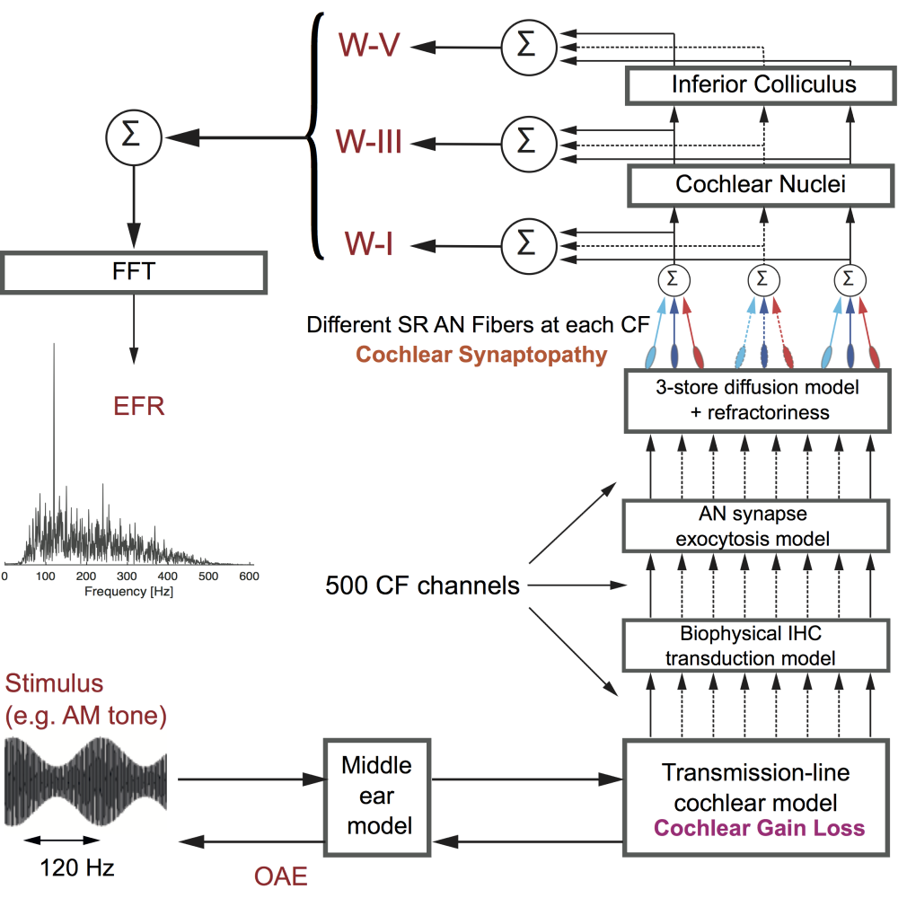
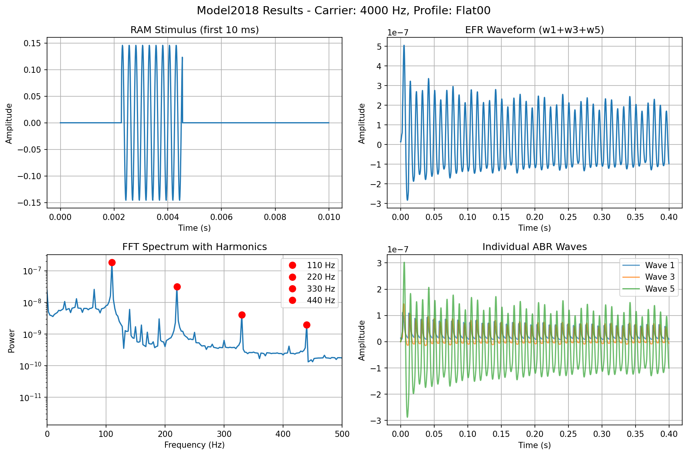

# Propuesta de Proyecto: Laboratorio Virtual Auditivo

## 1. Resumen

**Nombre:** Laboratorio Virtual Auditivo.

**Propósito:** Plataforma digital que integra el modelo de simulación biológica de *Verhulst et al.* para el análisis y procesamiento de datos auditivos en un entorno unificado y accesible.

**Objetivo Principal:** Permitir a fonoaudiólogas y profesionales de la audición cargar audiogramas, ejecutar de forma remota simulaciones predictivas complejas del sistema auditivo y visualizar los resultados de forma clara y procesable, sin la necesidad de recurir a profesionales de la simulación.

## 2. El Modelo de Verhulst (2018)

**¿Qué es el modelo de Verhulst?**

El modelo de Verhulst es una simulación computacional avanzada del sistema auditivo periférico humano. En el ámbito de la Investigación Fonoaudiológica y la Docencia de la Audición, este modelo funciona como un laboratorio de fisiología virtual. Permite a la investigadora fonoaudióloga o a la docente de Audiología manipular variables patológicas (como la pérdida de sinapsis en la 'Sordera Oculta') y observar en tiempo real cómo se altera la electrofisiología coclear y neural, algo imposible de realizar in vivo en humanos con fines meramente exploratorios.

**¿Qué es el EFR (Envelope Following Response)?**

El EFR es una métrica o biomarcador que refleja cómo el oído reacciona a un sonido y produce impulsos nerviosos sincronizados con la envolvente del estímulo. Es una señal eléctrica que se puede medir en el tronco cerebral.

**Entradas y Salidas de Verhulst**
* **Entradas:** Audiograma, datos biológicos y anatómicos de la simulación, y estímulo de entrada.
* **Salidas:** EFR, ANF (tasa de disparo de la fibra nerviosa), potenciales de membrana de la célula ciliada, respuestas del núcleo coclear y colículo inferior, y formas de onda de la ABR (respuesta auditiva del tronco cerebral).

### A. RAM Stimulus (Estímulo Modulado en Amplitud)
Es el "sonido de prueba" que se utiliza como **entrada** en el modelo o en una medición clínica. RAM significa *Rectangular/Round Amplitude-Modulated* (Tono modulado en amplitud). 
* **En palabras sencillas:** En lugar de ser un pitido constante (tono puro) o un chasquido breve (clic), es un sonido continuo cuyo "volumen" sube y baja periódicamente a una frecuencia constante (por ejemplo, a 100 Hz). Esta fluctuación constante obliga a las neuronas del sistema auditivo a sincronizarse y "disparar" impulsos al mismo ritmo de esa variación (la "envolvente").

### B. EFR Waveform (Forma de Onda de la Respuesta de Seguimiento de la Envolvente)
Es la **salida** principal. El EFR (*Envelope Following Response*) es la señal eléctrica o biológica que genera el cerebro (específicamente en el tronco encefálico) en respuesta al estímulo RAM.
* **En palabras sencillas:** Es la gráfica (onda) cruda en el tiempo que refleja cómo las neuronas auditivas están "siguiendo" o bailando al ritmo del volumen que sube y baja del estímulo RAM. Altera su amplitud (microvoltios) según la cantidad de neuronas sanas que logran sincronizarse.

### C. FFT Spectrum with Harmonics (Espectro FFT con Armónicos)
FFT significa *Fast Fourier Transform* (Transformada Rápida de Fourier). Es una operación matemática que convierte la forma de onda del EFR (que está en función del *tiempo*) a un gráfico en función de la *frecuencia*.
* **En palabras sencillas:** Extrae las frecuencias que "brotan" de la onda EFR. Como el estímulo RAM obligó a las neuronas a disparar a un ritmo exacto (ej. 100 Hz), el espectro FFT mostrará un pico muy alto en esa frecuencia exacta (Frecuencia Fundamental) y en sus múltiplos matemáticos llamados **armónicos** (200 Hz, 300 Hz, etc.). Esta amplitud en el espectro FFT es la métrica que realmente usan las fonoaudiólogas para diagnosticar qué tan fuerte fue la reacción neuronal.

### D. Individual ABR Waves (Ondas Individuales de ABR)
El ABR (*Auditory Brainstem Response* o Potenciales Evocados Auditivos de Tronco Cerebral) es otra respuesta neurológica producida ante sonidos más abruptos (como los clics). A diferencia del EFR, que es continuo, el ABR es una serie de picos (tradicionalmente numerados con números romanos: I, II, III, IV, V). 
* **En palabras sencillas:** El gráfico del ABR tiene varios picos sucesivos. Cada uno de ellos (*Individual ABR Waves*) se produce cuando el estímulo eléctrico pasa por una estación de "peaje" diferente del nervio auditivo y tronco cerebral (por ejemplo, la Onda I refleja el propio nervio auditivo y la Onda V representa el mesencéfalo). El modelo Verhulst también es capaz de simular la posición y el tamaño de estas ondas individuales para ubicar dónde existe un posible daño.

**Limitación Clínica Actual**

Generar un EFR simulado a partir de un audiograma no aporta información clínica nueva. Simular el EFR no cambia el diagnóstico ni revela nada que no se sepa ya, porque el modelo no es un predictor inverso (es decir, no puede deducir el audiograma a partir del EFR). 

**Utilidad y Relevancia**

Sirve para investigar cómo distintos tipos de daño (definidos arbitrariamente) afectan el EFR, lo cual puede guiar el desarrollo de nuevas pruebas diagnósticas o mejorar la interpretación de mediciones reales. Para eso es necesario entender los parámetros del modelo y las patologías que permite simular. En el campo más amplio de la fonoaudiología y audiología computacional, estos modelos se utilizan para varias cosas más, cosas que la práctica clínica y la industria están adoptando en la actualidad.

La **utilidad reina** de este modelo en fonoaudiología es servir como plataforma para diseñar, predecir y validar los exámenes auditivos. Al entender cómo una pérdida de sinapsis nerviosas (sordera oculta) modifica una señal, el modelo Verhulst permite a los investigadores crear pruebas más sensibles que algún día la fonoaudióloga sí instalará en su consultorio para identificar daños auditivos de manera muy temprana, antes de que lleguen a arruinar una audiometría estándar.

> Propuesta de investigación: Proponer pruebas de EFR que sean más sensibles a la sordera oculta. Esto implica que algunas pruebas van a permitir diferenciar entre un paciente con pérdida de audición tradicional y otro con sordera oculta. 
> El modelo de Verhulst es una herramienta fundamental para diseñar estas pruebas, ya que permite simular cómo diferentes tipos de daño afectan el EFR y, por lo tanto, guiar el desarrollo de pruebas más precisas. Entendiendo que esto luego debe complementarse con estudios clínicos para validar su efectividad en la práctica real.

**Beneficios de Visualización**

Además, como complemento, exploramos el modelo de Verhulst con la siguiente hipótesis:
> *"La visualización gráfica interactiva de los estados internos del modelo Verhulst/CoNNear (vibración de membrana basilar, potencial receptor IHC, liberación sináptica, tasas de disparo AN y EFR final) permitirá a los usuarios comprender con mayor profundidad los mecanismos fisiológicos subyacentes a la simulación y mejorar su capacidad de análisis clínico y educativo en comparación con la visualización tradicional que solo muestra el EFR final."*

Analizamos la evolución del modelo de Verhulst para mayor exploración y evaluamos la posibilidad de crear un software que permita al usuario obtener mayor valor de dicha simulación.

*🔗 [Acceso al estudio del modelo de Verhulst (2018)](https://www.sciencedirect.com/science/article/pii/S0378595517303477)*

## 3. Estructura del Sistema

El laboratorio está diseñado para manejar cálculos complejos en segundo plano, asegurando que la experiencia del usuario sea rápida y sin interrupciones.

* **Interfaz Investigativa y Educativa:** Una plataforma visual amigable enfocada en la carga de datos audiológicos de prueba (como audiogramas) y la visualización interactiva de las gráficas de simulación.
* **Motor de Simulación:** Un sistema que opera de forma invisible para el usuario, especializado en procesar algoritmos y modelos matemáticos complejos desarrollados por científicos de la audición, manteniendo la plataforma principal ágil y fluida.
* **Sistema de Gestión de Usuarios:** Un entorno seguro y privado para que cada investigador o clínico pueda acceder a sus propios datos, historiales de simulaciones y configuraciones, conservando la confidencialidad.

## 4. Componentes y Herramientas (Enfoque Funcional)

En lugar de detallar lenguajes de programación complejos, aquí se presenta cómo las herramientas seleccionadas benefician el trabajo de la fonoaudióloga investigadora o educadora:

* **Plataforma Visual Responsiva:** Creada para funcionar de forma fluida tanto en computadoras de escritorio como en tablets, permitiendo una fácil lectura gráfica de espectrómetros y respuestas neuronales simuladas.
* **Procesamiento de Archivos de Prueba:** Uso de tecnologías estables para recepcionar formatos de uso común en la investigación audiológica, asegurando que subir un audiograma o archivo de datos sea tan simple como adjuntar un archivo.
* **Representación Gráfica Interactiva:** Empleo de motores de gráficos avanzados que permiten hacer zoom, aislar variables (como diferentes frecuencias o intensidades) e interactuar con los resultados predictivos del nervio auditivo y la cóclea.
* **Procesamiento Matemático de Alto Rendimiento:** Infraestructura en la "nube" que permite tomar modelos de investigación (como el de Verhulst) que normalmente tardarían horas en una computadora personal y resolverlos de manera rápida y eficiente mediante procesamiento distribuido.
* **Seguridad y Resguardo de Datos:** Bases de datos seguras y sistemas de autenticación robustos que aseguran que la información ingresada por un profesional esté vinculada exclusivamente a su cuenta.

## 5. Etapa de Desarrollo (Fase de Simulación e Investigación)

El desarrollo de la plataforma se enfoca en una fase única y sólida, priorizando la estabilidad de la simulación científica y la experiencia del usuario investigador.

**Objetivo:** Establecer una infraestructura base funcional. Lograr que un profesional o investigador pueda registrarse, subir audiogramas, ejecutar la simulación del modelo auditivo de Verhulst y visualizar los resultados numéricos y gráficos en su panel de control.

**Alcance Funcional:** 
* Registro y acceso seguro de usuarios.
* Panel intuitivo para la carga de audiogramas u otros parámetros de configuración de la simulación.
* Ejecución de las ecuaciones y simulaciones en los servidores (sin sobrecargar la computadora del profesional).
* Generación de gráficos detallados que representan el estado funcional auditivo según los parámetros introducidos.
* Historial de simulaciones para realizar comparaciones a lo largo del tiempo o entre diferentes perfiles auditivos.

## 6. Recorrido del Investigador / Usuario (Paso a Paso)

1.  **Ingreso Seguro:** La fonoaudióloga investigadora inicia sesión en su cuenta personal a través de un portal seguro de la plataforma web.
2.  **Carga de Datos:** En su panel de control, el usuario sube un archivo con los datos de prueba (por ejemplo, audiogramas empíricos o teóricos).
3.  **Configuración de la Simulación:** El panel permitirá ajustar ciertas variables fisiológicas o patológicas relevantes para el estudio que se desea realizar.
4.  **Análisis en Segundo Plano:** El usuario envía la solicitud. El sistema procesa los cálculos complejos en un servidor remoto de alto rendimiento, evitando que el navegador del usuario se congele o bloquee.
5.  **Resultados:** Una vez terminada la simulación, los resultados regresan a la cuenta del usuario, guardándose en un historial permanente.
6.  **Interpretación Interactiva:** La fonoaudióloga puede explorar y analizar las gráficas interactivas resultantes directamente en su pantalla, facilitando el análisis fisiológico, educativo o para evaluar futuras pruebas.

## 7. Impacto Esperado en la Fonoaudiología y la Investigación Audiológica
La creación de esta plataforma representará un avance significativo en la manera de abordar el análisis auditivo computacional:
* **Accesibilidad de Modelos Complejos:** Se elimina el obstáculo de requerir conocimientos de programación o computadoras muy potentes. La fonoaudióloga solo se concentra en el diseño de experimentos y la comprensión fisiológica, mientras la plataforma hace el trabajo pesado.
* **Traducción de la Ciencia a Nuevos Diagnósticos:** Permite explorar modelos experimentales de manera sencilla, acortando la brecha entre los avances científicos de laboratorio y el desarrollo de futuras pruebas audiológicas.
* **Crecimiento Continuo:** La base del proyecto permite que, se puedan incorporar nuevos modelos auditivos desarrollados por la comunidad científica sin necesidad de reconstruir la plataforma.
